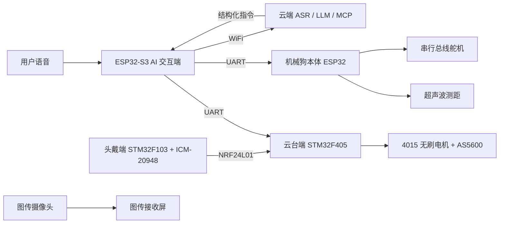

<!--  -->

<h1>全域挚友——语义驱动的多场景微型AI 机械狗</h1>
<h3>机械狗，自动武器站与AI</h3>

本项目基于ESP32与STM32开发。

项目包括：
一个微型的多功能机器狗底盘，并为其接入了云端大模型以实现语音交互。
一个作为机器狗任务模块范例的头瞄式水弹武器站。

<b>| 总成本约 ¥1340 | 尺寸约 30cm 级 | 接入云端大模型 | 语音控制 | 公里级远程遥控 | 头部追踪 |</b>

<!-- 徽章区域 -->

 

## 📖 目录

- [项目速览](#项目速览)
- [总体设计方案分析](#总体设计方案分析)
- [主要部分实现原理](#主要部分实现原理)
- [硬件设计](#硬件设计)
- [软件设计](#软件设计)
- [调试与优化](#调试与优化)
- [团队分工](#团队分工)
- [局限与后续](#局限与后续)
- [免责声明](#免责声明)
- [致谢与参考](#致谢与参考)
- [器件列表](#器件列表)

## 🎯 项目速览

- **项目定位**：低成本、可扩展、自然交互的微型 AI 机械狗平台
- **核心能力**：语音对话、自然语言指令、四足运动、超声波测距、头戴姿态跟随、第一视角图传、水弹发射
- **硬件架构**：ESP32-S3（AI交互核心）+ ESP32（机械狗主控）+ STM32F103（头瞄端主控）+ STM32F405（武器站主控）
- **通信方式**：WiFi /蓝牙/ UART / NRF24L01 2.4G 无线/5.8G 无线
- **控制算法**：基于C/C++的动作状态机、一阶低通滤波、PID 位置闭环、FOC 无刷电机控制等

---

## ✨ 总体设计方案分析
	
&emsp;&emsp;本设计由机械狗运动系统、AI 交互系统、姿态采集系统、视频图传系统、云台炮塔跟随系统和无线通信系统组成。由于系统中同时存在多个单片机、多个传感器、多个执行机构以及软件上的算法和兼容协调问题，因此其控制特点体现在多模块协同、实时性要求较高、供电负载变化较大和调试过程较复杂几个方面。 
本系统的设计思路如下： 
1）通过ESP32-S3 语音开发板采集使用者语音，并利用WiFi 与云端大语言模型进行连接，使机械狗能够完成语音对话和自然语言指令解析，为其他功能的控制奠定基础以及实现与人的交流互动； 
2）通过机械狗本体ESP32 主控板接收ESP32-S3 下发的动作指令，结合MCP 服务，根据指令内容控制机械狗执行前进、后退、测距、开火等所具有的动作，统一了代码接口，新的硬件功能也容易加入进来； 
3）通过头戴式姿态采集端获取操作者头部姿态角，结合PID 算法与其他器件的控制，实现云台的平滑跟随，让武器端可以自由控制； 
4）通过3D 打印结构件和模块化安装方式，将机械狗本体与云台扩展模块结合起来，构成一个能够运动、交互和观察的综合平台，实现复杂连贯的功能。 

&emsp;&emsp;对于该项目而言，系统使用的核心模块较多，且执行机构包括多路总线舵机和两轴无刷云台电机，因此对供电性能有较高要求。机械狗在启动、转向或快速改变姿态时，舵机会产生较大的瞬时电流；云台电机在快速跟随时也需要稳定的电压输入。如果供电能力不足，可能会造成舵机复位、单片机掉电、无线通信中断或云台抖动等问题。因此，在硬件设计中需要对主控、舵机和云台部分进行分路供电，并保证共地连接可靠。 
&emsp;&emsp;控制性能上，机械狗本体动作需要具有一定的稳定性，语音指令下发后不能出现明显延迟或误动作；姿态跟随云台需要具有较好的实时性和连续性，避免因数据丢包、传感器漂移或控制参数不合适而出现跳变和震动。由于经济限制，本项目为可拓展与硬件升级的雏形，主要保证基本功能完整、动作过程稳定、模块之间通信可靠、整体结构便于展示和维护。 
&emsp;&emsp;
	

---

## 🏗️ 主要部分实现原理
1.**语义驱动控制** 
&emsp;&emsp;语义驱动控制部分主要完成“语音输入—语义理解—工具调用—指令生成—动作执行”的过程。与传统机器人依赖固定按键或预设命令不同，本课题希望使用者能够通过较自然的语言与机械狗进行交互。例如，当使用者说出“向前走一点”“停下来”“转过去看看”或“点点头”等口语化表达时，系统能够从语句中提取动作意图，并将其转换为机械狗底层可以识别和执行的控制命令，从而实现较自然的人机交互。 
&emsp;&emsp;本系统采用ESP32-S3 作为AI 语音交互终端。ESP32-S3 首先通过麦克风采集语音信号，并在本地完成唤醒、音频数据整理等基础处理。唤醒成功后，系统通过WiFi 将音频上传至云端服务，由语音识别模块完成语音转文本，再由大语言模型对文本语义进行理解。为了使模型不仅能够“听懂”用户的话，还能够进一步调用设备功能，系统在初始化联网时会通过MCP（ModelContext Protocol）机制，将已注册的工具信息同步给云端模型。这样，当模型识别到“点头”“前进”“左转”等动作意图时，就不只是返回普通文本回答，而是能够结合上下文判断当前请求属于某个可调用工具，并生成对应的结构化控制结果。 
&emsp;&emsp;执行过程中，云端模型根据MCP 提供的工具描述，将自然语言请求映射为底层动作参数，例如把“向前走”映射为FORWARD，把“向左转”映射为LEFT，把“停下”映射为STOP，把“点点头”映射为对应的动作编号或控制字段。ESP32-S3 接收到云端返回的结构化结果后，再通过UART 串口将指令发送给机械狗本体ESP32 主控。ESP32 主控收到数据后，首先对数据帧格式进行校验，然后根据动作字段切换机械狗当前的运动状态或执行对应动作。动作执行完成后，机械狗还可以将当前状态或异常信息回传给ESP32-S3，并通过扬声器或显示模块进行反馈，形成“语音输入—语义理解—动作执行—状态反馈”的闭环控制流程。 

2.**武器站云台跟随** 
&emsp;&emsp;云台的核心是姿态跟随（PID 算法），主要完成“头部姿态采集—无线数据传输—云台角度跟随”的过程。该模块采用分体式结构，头戴控制端由操作者佩戴，负责采集头部姿态；云台执行端安装在机械狗上方，负责根据接收到的角度数据完成方向跟随。该设计的优势在于操作方式直观，使用者不需要通过摇杆控制两个轴的角度，只需要转动头部即可改变云台指向。 
&emsp;&emsp;头戴端使用ICM-20948 九轴姿态传感器获取姿态信息。传感器内部包含陀螺仪、加速度计和磁力计，可以采集角速度、加速度和地磁方向等数据。通过I2C 接口读取传感器数据，姿态解算得到偏航角和俯仰角。为减少每次上电时初始佩戴姿态不同带来的误差，程序设置了零点校准步骤，即将系统启动后的初始头部方向作为基准方向，之后计算相对于基准方向的角度变化。 
&emsp;&emsp;姿态数据经过处理后，由NRF24L01 无线模块发送至云台端。该模块工作在2.4G 频段，体积小、成本低、通信速度较快，适合在课程设计模型中实现短距离无线数据传输。为了提高通信稳定性，发送端将角度数据打包成固定长度数据帧，接收端对帧头、帧尾和数据范围进行判断，避免错误数据直接进入控制环节。云台执行端使用STM32F405RGT6 作为主控，结合无刷云台电机和AS5600 磁编码器实现闭环控制。磁编码器能够提供电机轴的角度反馈，主控将目标角度与实际角度进行比较，根据误差输出控制量，使电机逐渐转动到目标位置。与普通舵机相比，无刷云台电机运行更平滑，机械回差较小，更适合完成连续的姿态跟随演示。 

3.**整体方案** 
&emsp;&emsp;本项目采用“机械狗主体+ 功能扩展模块”的总体设计方案。机械狗本体作为系统的主要移动平台，负责完成运动执行和模块承载；ESP32-S3 AI 交互模块作为上层控制入口，负责语音采集、网络连接、云端转发、语义解析结果接收以及语音反馈；头戴端作为姿态输入设备，负责采集操作者头部的偏航角和俯仰角，图传设备和头戴端可合二为一；云台端作为扩展执行模块，负责根据姿态数据完成两轴跟随和观察方向调整。各部分既可以独立调试，又能够通过串口通信、无线通信和机械结构连接组合成完整系统，从而形成一个具有语音交互、运动控制和姿态跟随能力的微型AI 机械狗平台。 
&emsp;&emsp;供电上，机械狗本体采用3S 锂电池作为主要动力来源，并通过降压模块分别为主控板、舵机和外围传感器供电。由于串行总线舵机在启动、转向和姿态调整时会产生较大的瞬时电流，如果主控和舵机共用不稳定电源，容易导致单片机复位或通信异常，因此本项目在设计时将主控供电与舵机供电分开处理，并保证各模块之间可靠共地。ESP32-S3 语音模块采用独立稳压供电，以保证WiFi 通信、语音采集和音频播放过程的稳定性。云台模块则采用独立主控和独立供电方案，使其能够在不影响机械狗运动系统的情况下单独完成调试与优化。 
&emsp;&emsp;通信上，ESP32-S3 与机械狗主控之间采用UART 串口通信。ESP32-S3 在接收到云端模型返回的结构化动作指令后，通过TX/RX 引脚将指令发送给机械狗主控，机械狗主控再根据指令字段调用对应的动作函数。该方式连接简单、延迟较低、调试直观，适合课程设计中的功能验证。头戴端与云台端之间采用NRF24L01 无线通信，避免操作者与机械狗之间受到线缆限制。云台端内部通过I2C 接口读取AS5600 磁编码器的角度反馈，并结合无刷电机驱动与FOC 控制算法实现位置闭环，使云台能够较平滑地跟随操作者头部姿态变化。 
&emsp;&emsp;结构设计上，机械狗主体和扩展外壳主要采用3D 打印方式制作。该方式成本较低，修改灵活，便于根据PCB 尺寸、屏幕位置、接口开孔和线束走向进行多次调整。云台模块通过螺钉固定在机械狗背部扩展位置，与本体之间保持相对独立，后期可以根据需要拆下或替换为其他功能模块，如机械臂、照明模块、红外测温模块或环境检测模块。这样的设计体现了课程设计中“先实现基础功能，再进行模块扩展”的思路，也为后续进一步集成视觉识别、环境感知和自主任务执行提供了硬件基础。 

----------

## 🔧 硬件设计
&emsp;&emsp;硬件设计是本项目能够实现功能的基础，是作品的骨架和支撑。根据系统功能划分，硬件部分主要包括机械狗本体硬件、AI 语音交互硬件、头戴姿态采集硬件、图传硬件、云台执行硬件、无线通信硬件和供电硬件。器件选型时主要考虑成本、体积、性能、资料完整程度以及调试难度，尽量选择常用、资料较多、便于购买和维护的模块。 

1.**机械狗本体设计** 
&emsp;&emsp;机械狗本体是整个系统的移动平台，主要由3D 打印结构件、舵机、主控板、电池、传感器以及连接线束组成。机械结构部分采用3D 打印方式制作，能够根据舵机尺寸和安装孔位进行灵活设计。机身中部预留电池仓和控制板安装位置，四条腿分别由多个舵机构成，通过舵机角度变化实现腿部摆动和支撑。 
&emsp;&emsp;机械狗运动主控采用ESP32 控制板。ESP32 资料丰富，外设接口较多，并支持串口通信、定时器控制、I2C 传感器读取和动作状态机运行等功能，能够满足机械狗本体运动控制需求。主控板接收来自ESP32-S3 的动作指令后，根据预设步态表或运动函数控制各关节舵机转动，实现前进、后退、左转、右转和停止等基本运动动作。 

&emsp;&emsp;执行机构采用串行总线舵机。总线舵机相比普通PWM 舵机具有接线简单、控制精度较高、可读取反馈信息等优点。多个舵机可以通过同一条总线串联，减少机身内部线束数量，使机械狗内部结构更加整洁。调试时可以分别设定每个舵机的ID 和初始角度，保证四条腿在初始状态下姿态一致。 
&emsp;&emsp;AI 语音交互硬件以ESP32-S3 开发板为核心。ESP32-S3 集成WiFi 和蓝牙功能，并具有较强的音频处理和边缘计算能力，适合用于语音采集、网络通信和简单的人机交互任务。语音输入部分采用I2S 数字麦克风，能够获得较清晰的语音信号；语音输出部分采用功放模块和小型扬声器，用于播放系统回复和动作反馈。自主画电路板将芯片与一些就基础模块集成便于后续的模块化开发。 

&emsp;&emsp;环境感知方面，机械狗前部设置超声波测距模块，用于检测前方障碍物距离。当机械狗在前进过程中检测到距离过近时，主控可以执行停止或转向动作，避免直接碰撞。机身内部还可以安装MPU6050 等惯性测量模块，用于获取机体俯仰等变化，为姿态稳定和运动补偿提供数据基础。 

2.**头戴控制端设计** 
&emsp;&emsp;头戴控制端的设计重点是轻量化、低功耗和佩戴方便。该端主要由STM32F103C8T6 最小系统板、ICM-20948 九轴姿态传感器、NRF24L01 无线模块、电池和电源升压模块组成。各模块体积较小，可以安装在头戴支架或小型盒体中，使用时由操作者佩戴在头部。STM32F103C8T6 负责读取姿态传感器数据，并将数据进行滤波、零点校准和打包发送。ICM-20948 能够输出加速度、角速度和磁场数据，为姿态解算提供基础。由于传感器原始数据存在噪声和漂移，程序中需要对数据进行简单滤波，并设置启动校准过程，使系统在不同佩戴角度下都能获得相对稳定的姿态变化量。 
&emsp;&emsp;无线通信模块采用NRF24L01+PA+LNA。该模块带有功放和低噪声放大电路，通信距离和抗干扰能力优于普通NRF24L01 模块。头戴端只需要将姿态角数据单向发送至云台端，因此通信协议可以设计得较为简单，只需保证帧格式固定、数据范围合理即可。

| 器件类别 | 具体型号 | 功能说明 |
| :--- | :--- | :--- |
| 主控芯片 | STM32F103C8T6 | 负责传感器读取、姿态角处理和无线发送 |
| 姿态传感器 | ICM-20948 | 采集头部加速度、角速度和磁场信息 |
| 无线通信 | NRF24L01+PA+LNA | 将姿态角数据发送至云台执行端 |
| 供电模块 | 18650 电池及升压板 | 为头戴端提供独立电源 |
| 结构支架 | 3D 打印头戴支架 | 固定传感器和主控，方便佩戴与调试 |

3.**武器站设计** 
&emsp;&emsp;武器站部分的硬件均为自主建模与3D 打印，主要由头戴控制端和云台执行端组成。头戴控制端负责采集操作者头部姿态，云台执行端负责根据姿态数据完成方向跟随。该部分采用独立供电、独立通信和独立控制方式，不影响机械狗本体的基本运动功能。该端主要由STM32F405RGT6主控、无刷云台电机、FOC 驱动板、AS5600 磁编码器、NRF24L01 接收模块和图传模块组成。STM32F405RGT6 具有较高主频和浮点运算能力，能够满足姿态数据解析、编码器读取和闭环控制计算等需求。 
&emsp;&emsp;执行电机选用4015 无刷云台电机。该类电机具有转动平滑、噪声较低、力矩输出连续等优点，适合用于摄像头云台和姿态跟随平台。为了获得电机实际角度，系统在电机轴端安装AS5600磁编码器。AS5600 能够输出绝对角度信息，主控通过I2C 接口读取该角度，与目标角度进行比较后输出控制量。 
&emsp;&emsp;云台端还搭载5.8G 图传模块（可分离），用于传输第一视角画面。图传系统能够使操作者从云台视角观察前方环境，与头部姿态跟随功能结合后，可以形成较直观的“看向哪里，画面转向哪里”的演示效果。由于图传模块对电源稳定性有一定要求，因此在供电设计中应与电机驱动部分做好隔离和滤波，减少电机动作对画面的干扰。 

| 器件类别 | 具体型号 | 功能说明 |
| :--- | :--- | :--- |
| 主控芯片 | STM32F405RGT6 | 负责无线接收、数据解析和云台闭环控制 |
| 无刷驱动 | 灯哥开源 V3P 驱动 | 驱动无刷云台电机，实现 FOC 控制 |
| 执行电机 | 4015 无刷云台电机 | 完成云台偏航和俯仰两个方向的转动 |
| 位置编码 | AS5600 磁编码器 | 提供电机轴角度反馈，构成闭环控制 |
| 视频图传 | 5.8G 图传模块 | 传输第一视角画面，方便远程观察演示 |
| 供电模块 | 降压稳压模块 | 为主控、驱动和图传模块提供稳定电压 |

----------

## 💻 软件设计
   &emsp;&emsp;软件部分决定了各个硬件模块能否稳定协同工作。根据功能划分，软件设计主要包括机械狗AI 交互、头戴端控制、云台武器端控制以及无线通信。软件整体采用分层设计思想，上层负责语义交互和任务判断，下层负责具体动作控制和执行机构驱动，两者分别完成用通信协议连接起来。 
    1. **AI 交互** 
&emsp;&emsp;AI 交互部分是本课题智能的核心。接入AI 小智大模型到ESP32-S3 上，设置MCP 服务，语言交互以及调用控制已有的所有功能。 
&emsp;&emsp;程序运行后，ESP32-S3 首先进入待唤醒状态，持续监听外部声音。当检测到设定唤醒词后，系统开始录制语音，并将音频数据整理为云端接口可以接收的格式。音频上传后，云端服务完成语音识别和语义理解，并返回对应文本或结构化指令。对于聊天类问题，ESP32-S3 直接将返回内容通过语音合成模块播放出来；对于动作类指令，ESP32-S3 则提取其中的动作字段，并通过串口发送给机械狗本体ESP32 主控。 
&emsp;&emsp;为了减少自然语言带来的不确定性，程序中预先设置了动作关键词和标准指令之间的对应关系。例如，“前进、往前走、向前移动”均对应前进指令；“停下、停止、别动”均对应停止指令；“左转、向左看、往左转”均对应左转指令。这样可以提高识别成功率，也可以避免大语言模型返回过长文本导致底层主控难以解析。 
&emsp;&emsp;ESP32-S3 与机械狗本体ESP32 之间采用简单串口协议通信。每一条动作指令由帧头、指令字、参数位和校验位组成。帧头用于判断一条数据的开始，指令字用于表示动作类型，参数位用于表示持续时间或动作幅度，校验位用于判断传输是否正确。机械狗本体ESP32 接收到数据后，根据指令内容进入相应状态，并在动作完成后返回执行结果。ESP32-S3 再根据返回结果进行语音提示，如“已前进”“已停止”“前方有障碍”等。 

2.**头戴端控制** 
&emsp;&emsp;头戴端控制部分负责完成姿态数据采集、姿态解算和无线发送。程序启动后，STM32F103C8T6首先完成ICM-20948 和NRF24L01 模块初始化，通过ICM-20948 获取头部加速度、角速度等数据，并利用内部DMP 完成姿态解算，将四元数转换为偏航角和俯仰角。由于不同操作者佩戴角度存在差异，系统启动时会进行零点校准，将当前状态作为参考方向，后续只计算头部相对变化量。 
&emsp;&emsp;处理后的姿态数据经过简单滤波后，通过NRF24L01 无线发送至云台端。为了降低通信延迟，数据帧仅包含偏航角、俯仰角和校验信息，并采用固定格式传输。当出现异常数据或通信中断时，程序会进行数据判断，避免错误角度直接影响云台运动，提高系统稳定性。 

3.**云台武器端控制** 
&emsp;&emsp;云台武器端负责姿态数据接收、角度解析和闭环控制。STM32F405RGT6 接收到头戴端发送的数据后，对目标角度进行解析和滤波，并结合AS5600 磁编码器获取电机实际角度，通过比较目标角度与反馈角度之间的误差，实现云台位置闭环控制。 
&emsp;&emsp;执行机构采用两台4015 无刷云台电机，通过FOC 算法控制偏航和俯仰两个方向转动。相比普通舵机，无刷电机具有运行平滑、响应速度快等特点，更适合连续姿态跟随。控制过程中加入PID 调节和角度限幅，减少电机震荡和机械冲击，使云台能够稳定完成“人看哪里，云台转向哪里”的跟随效果。 
&emsp;&emsp;其中武器的开火设定为高电平下连续开火，也就是通过控制电平可以实现全自动开火，收到的云台芯片指令即为简单的电平信号。 
4.**无线通信** 
&emsp;&emsp;无线通信部分主要用于头戴端和云台端之间的姿态数据传输。由于姿态跟随对实时性有一定要求，因此数据帧需要尽量简洁，通信过程需要尽量稳定。头戴端将偏航角和俯仰角转化为整型数据后发送，云台端接收到数据后再恢复为角度值，并作为云台控制目标。 
&emsp;&emsp;头戴端程序的主要流程为：初始化STM32 外设、初始化ICM-20948、初始化NRF24L01、进行姿态零点校准、循环读取姿态数据、进行滤波处理、打包发送数据。由于头部姿态变化较为连续，发送数据时不需要包含过多信息，只需发送偏航角、俯仰角和简单校验即可，这些数据发送给云台端。 
&emsp;&emsp;云台端程序的主要流程为：初始化STM32F405、初始化NRF24L01、初始化AS5600 编码器、初始化FOC 驱动参数、等待接收姿态数据、判断数据是否有效、对目标角度进行限幅和滤波、执行闭环控制。若一段时间内未接收到头戴端传来的有效数据，云台端会保持当前角度或缓慢回到安全位置，避免因通信中断造成异常动作。在实际调试中，无线通信容易受到实验室WiFi、蓝牙设备和电源噪声甚至电磁干扰等影响。 
&emsp;&emsp;为提高系统稳定性，程序中加入了数据有效性判断和异常跳变抑制。当接收到的数据超出合理范围，或相邻两帧角度变化过大时，接收端不会立即执行该数据，而是将其视为异常帧丢弃。这样可以减少丢包或误码造成的云台突然跳动。 

5.**算法设计** 
&emsp;&emsp;算法主要包括语义指令映射、机械狗动作状态机、姿态角滤波算法、云台PID 闭环控制算法和安全限幅算法。虽然这些都不是复杂的算法，但它们直接影响系统运行效果，是课程设计中非常重要的部分。 
1）语义指令映射算法。语音识别得到的文本往往不是固定格式，因此需要将自然语言中的关键词提取出来，并映射成ESP32 能够识别的标准动作。程序中建立动作词库，将相近表达归为同一类动作。例如“向前走”“前进一下”“往前移动”都映射为FORWARD；“停下”“暂停”“不要动”都映射为STOP。通过这种方式，系统能够适应一定程度的口语表达。 
2）机械狗动作状态机。机械狗的动作不应由单个瞬时指令直接控制，而应由状态机进行管理。系统设置待机、前进、后退、左转、右转、避障、停止等状态。每个状态对应一组舵机角度变化规律。当主控接收到新指令时，先判断当前状态是否允许切换，再执行对应动作。这样可以避免机械狗在动作未完成时突然切换导致姿态不稳。 
3）姿态角滤波算法。姿态传感器采集到的数据会受到手部抖动、传感器噪声和零漂影响，如果直接用于云台控制，会导致云台持续轻微抖动。因此程序中采用一阶低通滤波对目标角度进行平滑处理，其形式如下：

$$
y(k) = \alpha x(k) + (1-\alpha)y(k-1) \quad (1)
$$

式中，\(x(k)\) 为当前采集角度，\(y(k)\) 为滤波后角度，\(\alpha\) 为滤波系数。\(\alpha\) 越大，响应越快但抖动越明显；\(\alpha\) 越小，输出越平滑但跟随会变慢。实际调试时需要根据云台响应情况选择合适参数。

4）云台闭环控制算法。云台控制采用位置闭环思想，将目标角度与编码器反馈角度进行比较，根据误差输出控制量。基本 PID 控制公式如下：

$$
u(k) = K_p e(k) + K_i \sum_{j=0}^{k} e(j) + K_d \big[e(k)-e(k-1)\big] \quad (2)
$$

其中，\(e(k)\) 表示当前角度误差，\(K_p\)、\(K_i\)、\(K_d\) 分别为比例、积分和微分系数。比例项决定系统响应速度，积分项用于消除稳态误差，微分项用于抑制变化过快带来的超调。在本项目中，为了减少云台抖动，积分项不宜设置过大，同时需要配合死区控制。

5）安全限幅算法。为了避免云台转动角度过大造成线材缠绕或结构干涉，程序中设置了角度限幅。当目标角度超过最大允许范围时，系统自动将其限制在边界值内。同时，当检测到连续异常数据或通信中断时，云台不继续执行新目标，而是保持当前位置。该算法虽然简单，但能有效提高系统安全性和稳定性。

----------
## 🐛 调试与优化
&emsp;&emsp;系统调试过程中，团队主要遇到了语音识别不稳定、舵机动作不协调、无线通信丢包、云台零点抖动和机械结构干涉等问题。通过逐步排查和修改程序，系统运行稳定性得到明显改善。 
1）本地MCP 指令解析问题。初期测试时，ESP32-S3 能够完成语音识别，但大语言模型返回的内容较长，有时包含解释性文字，导致机械狗本体ESP32 无法直接识别动作指令。针对该问题，团队在ESP32-S3 端增加了关键词提取和指令映射步骤，只将标准动作指令发送给ESP32，而不是将完整回复发送到底层主控。另外，流行的几种MCP 方案均为两芯片连接至同局域网的方案，这种办法不稳定，并且实现起来复杂，要配置各种环境，于是本作品采取本地的MCP 方案，让大模型对功能的调用执行通过物理跳线实现。这样既保留了对话功能，又保证了动作控制的可靠性。 
2）机械狗站立姿态偏斜问题。在本体调试过程中，机械狗有时会出现站立不平稳或行走时向一侧偏移的现象。经过检查发现，主要原因是部分舵机初始角度不一致，且左右腿结构安装存在细小误差。解决方法是重新标定每个舵机中位值，并在程序中为不同关节设置角度补偿。调整后，机械狗站立姿态更加稳定，前进时偏移现象有所减轻。 
3）供电瞬态压降问题。机械狗多个舵机同时动作时，电流需求会瞬间增大，曾出现主控板复位和语音模块重启的情况。针对该问题，团队将主控供电和舵机供电分开，增加降压模块余量，并在电源输入端增加滤波电容。分路供电后，机械狗连续动作时系统稳定性明显提高。 
4）无线通信丢包与角度跳变问题。在实验室环境中，NRF24L01 偶尔会受到其他2.4G 设备影响，导致接收端数据短时间异常。若异常数据直接用于控制，云台会出现突然跳动。针对该问题，程序中加入数据范围判断和角度变化率判断。当单帧数据变化过大时，系统先判断为异常帧并丢弃；只有连续多帧数据变化趋势一致时，才认为操作者确实进行了快速转头动作。 
5）云台零点微震问题。静态测试中，当操作者头部保持不动时，云台仍可能出现轻微抖动。分析原因主要是姿态传感器存在微小噪声，编码器反馈也有一定波动，导致控制器不断进行小幅修正。解决方法是在角度误差较小时加入控制死区，当误差小于设定阈值时，控制器不再输出明显修正量，同时适当降低PID 参数中的比例和积分系数，使云台在静止状态下更加平稳。 
6）机械结构重心与干涉问题。云台在俯仰角度较大时，部分结构件可能与机械狗背部平台或图传摄像头线材发生干涉。针对该问题，一方面在程序中加入角度限幅，限制云台最大俯仰角和偏航角；另一方面对3D 打印支架进行修改，增加线材固定点和转动空间。经过调整后，云台在正常演示角度内能够较顺畅地转动。 
经过多轮调试后，系统基本实现了预定功能。机械狗可以在平整地面完成基本移动动作，ESP32-S3 可以完成语音交互和动作指令下发，头戴端可以将姿态变化无线发送至云台端，云台能够跟随操作者头部方向进行转动。虽然系统距离成熟产品还有一定差距，但作为小型项目，已经较完整地体现了智能交互、嵌入式控制和模块化机器人的设计思路。 

## 👥 团队分工

&emsp;&emsp;我：部件选型与采购；硬件设计与建模；PCB设计；多单片机协作的设计与开发；滤波与PID算法的开发；与武器站、头戴端相关程序的编写与调试；硬件装配与测试。 
&emsp;&emsp;我的另一位队友：云端大模型与各模块的接入与通信工作；大模型的配置、提示词处理与工具调用；配置UART通信；与AI、超声波测距相关程序的编写。 

    

----------

## 🔭 局限与后续

&emsp;&emsp;对于本项目，我们已经实现了语音交互、机械狗基础动作、姿态跟随、武器全自动开火、无线通信等功能，具有多方协调与初具只能的优点，但距离更加智能、稳定的机械狗仍有不少可以继续改进的地方。 
首先，机械狗运动稳定性仍有提升空间。当前机械狗能够完成基本运动，但在负载增加、地面不平或连续动作时，机身姿态可能不稳。后续可以引入与优化平衡算法，增加机身姿态反馈，使机械狗能够根据外部反馈数据自动调整腿部动作，提高运动过程中的稳定性。 
&emsp;&emsp;其次，AI 交互功能对网络环境仍有一定依赖。当前语音识别和语义理解主要依靠云端服务完成，当网络状态不稳定或距离网源较时，系统响应速度和交互连续性会受到影响。后续可以尝试引入边缘计算小程序，在本地部署轻量化语音识别模型或小型语言模型，使机械狗在离线或弱网环境下也能完成基础交互。 
&emsp;&emsp;再次，云台跟随精度和稳定性还可以继续优化。当前云台能够跟随头部姿态变化，但在快速转头或机械狗运动过程中，仍可能出现滞后和抖动。后续可以在滤波算法、控制死区和机身运动补偿方面继续改进，或者引入串级PID，实现更精细的反馈闭环控制，使云台在动态情况等也能保持较稳定。 
&emsp;&emsp;此外，视觉系统后续可以增加图像处理模块，结合YOLO、OpenMV 色块识别或轻量化目标检测算法，实现目标识别、人体识别、路线识别和自动巡检等功能。这样机械狗就不只是按照语音指令执行动作，而是能够根据环境信息做出更主动的判断，朝着具身智能迈进一步。 
&emsp;&emsp;最后，也是最重要的两个关联点，目前很大的不足是硬件性能不够以及衍生的结构设计缺陷，机械狗主体是ESP32，运算和内存性能都较低，支撑不了较强的处理算法、实时反馈的运动控制，若非原结构与集成的限制，可改用树莓派等板子，利用强化学习而非固定代码让机械狗自己运动以及部署深度学习视觉处理，此时也可以在离线模式下进行AI 交互，而机身与低扭矩的舵机让机械狗承载能力不足，让拓展性受到了限制。 

----------

## ⚠️ 免责声明

本项目为课程设计与学习交流用途，发射模块仅用于水弹娱乐演示，安全无害，比动能小于1.8J/cm²。请勿改装为危险装置，请勿对准人或动物，操作时请佩戴护目镜并遵守当地法律法规。 

----------

## 🙏 致谢与参考

-   我的另一位团队成员 
-   课程指导老师，他一语点醒梦中人，告诉我电机运行会产生电磁干扰，可能是导致I2C总线死锁的原因 
- 帮我干活的Gemini，GPT，deepseek和豆包 
-  小智AI.Dev 
-   Espressif ESP32 / ESP32-S3 官方资料 
-   SimpleFOC 开源项目 
-   SparkFun ICM-20948 库 
-   Anthropic MCP 协议 

**参考文献**： 
[1] 侯焱彬, 杨永辉, 李志刚, 等. 面向工业气体安全监控的智能巡检机械狗[J]. 工业控制计算机,2026,39(5):63-64+67. 
[2] 夏立伟. 四足机械狗在化工安全领域的应用[J]. 石化技术,2025,32(6):348-350. 
[3] 潘杰. 基于MCP 智能体架构的“本地-云端大模型协同”优化方案研究[J]. 电脑编程技巧与维护,2026,(2):3-6+11. 
[4] 夏峰. 头盔瞄准系统的人机交互研究及设计[D]. 哈尔滨工业大学,2013. 
[5] 王云龙, 赵正媛, 吴志林, 等. 轻型遥控武器站多工况力学特性及射击扰动[J]. 兵工学报,2025,46(10):366-380. 
[6] 郭丽君, 周文杰, 刘杰, 等. 一种超轻型遥控武器站的设计[J]. 电脑与信息技术,2025,33(4):122-127. 
[7] Anthropic. Model Context Protocol Specification[EB/OL]. (2024-11-25)[2026-07-05].https://modelcontextprotocol.io/specification. 
[8] Espressif Systems. ESP32 Series Datasheet and ESP32-S3 Series Datasheet[EB/OL]. [2026-07-05]. https://www.espressif.com/en/support/documents/technical-documents. 
[9] Nordic Semiconductor. nRF24L01+ Single Chip 2.4GHz Transceiver Product Specificationv1.0[EB/OL]. Nordic Semiconductor, 2008. 
[10] TDK InvenSense. ICM-20948 Datasheet[EB/OL]. TDK Corporation, 2016. 
[11] Redmon J, Divvala S, Girshick R, Farhadi A. You Only Look Once: Unified, Real-TimeObject Detection[C]//Proceedings of the IEEE Conference on Computer Vision and PatternRecognition. 2016:779-788. 
[12] Liao Q, Zhang Z, Ke W, et al. Review of Quadruped Robots for Dynamic Locomotion[J/OL]. arXiv preprint arXiv:2005.11134, 2020. 
[13] Mudalige N D W, Van K D, Han J, et al. HyperDog: An Open-Source Quadruped RobotPlatform Based on ROS2 and micro-ROS[J/OL]. arXiv preprint arXiv:2209.09171, 2022. 

    

----------
## 📦 器件列表

| 应用模块 | 器材名称与规格 | 价格（元） |
| :--- | :--- | :--- |
| 云台主控 | STM32F405RGT6 × 2 | 79.60 |
| 云台转接 | DengFOC STM32 转接板 | 40.00 |
| 供弹结构 | 硅胶管 | 3.16 |
| 图传系统 | 图传线 | 12.90 |
| 调试工具 | CH340G 串口调试器 | 6.80 |
| 接口转接 | Type-C 垂直转接头 | 13.50 |
| 无刷驱动 | 灯哥开源双路无刷电机控制板 | 84.00 |
| 发射控制 | 大功率 MOS 管 | 7.26 |
| 云台电机 | 4015 直流无刷电机 × 2 | 231.28 |
| 烧录调试 | ST-Link 烧录器 | 6.79 |
| 云台结构 | 铝合金底座转盘轴承 | 22.70 |
| 供电系统 | 降压板 | 34.80 |
| 图传系统 | 5.8G 天线 | 5.50 |
| 散热系统 | 散热风扇 | 3.25 |
| 电源接口 | XT30 接头 | 13.50 |
| 辅助瞄准 | 激光头 | 11.70 |
| 供电系统 | 电源分路器 | 53.00 |
| 连接材料 | 导线 | 4.88 |
| 云台结构 | 光轴 | 6.08 |
| 姿态采集 | ICM20948 九轴陀螺仪 | 43.00 |
| 发射耗材 | 高抗压加硬水弹 | 3.69 |
| PCB 辅料 | 排针排母、开关、PCB 微型元件等 | 24.85 |
| 无线通信 | NRF24L01+LAN 无线模块 × 2 | 17.92 |
| 紧固件 | 螺丝 | 11.94 |
| 结构制作 | 3D 打印耗材 | 29.00 |
| 图传系统 | 2W 图传 + 1500 线摄像头 | 170.00 |
| 图传接收 | 图传眼罩接收屏 | 289.00 |
| 图传系统 | 图传天线 | 22.46 |
| 发射机构 | 水弹波箱 | 46.40 |
| 发射机构 | 弹匣 | 19.00 |
| 外观装饰 | 模型水贴 | 13.00 |
| 云台结构 | 薄壁轴承 × 4 | 8.84 |
| **项目总造价** | | **1339.80** |

## 📄 License

MIT License，详见 [LICENSE](https://license/)。
